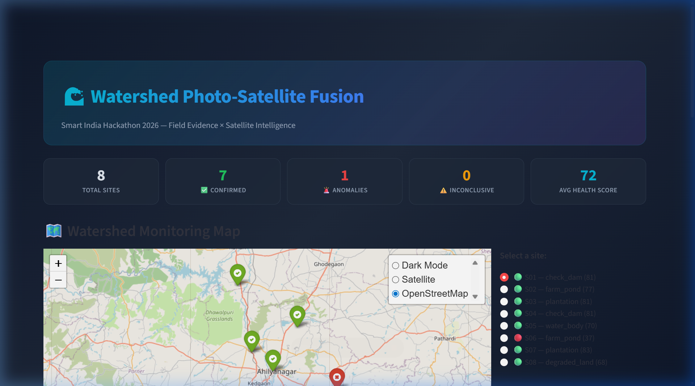
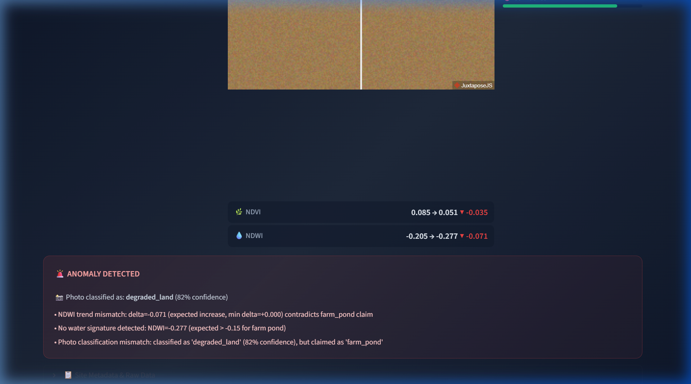

# 🛰️ Clean Water Initiative

[](https://www.python.org/downloads/)
[](https://streamlit.io/)
[](https://globe.gl/)
[](https://earthengine.google.com/)
[](https://github.com/mlfoundations/open_clip)
[]()

> **Field Evidence × Satellite Intelligence** — Ground Truth Verification and Condition Monitoring Layer for Watershed Interventions.

---

## 📌 Problem Statement

Field workers routinely upload geo-tagged photos of watershed interventions (such as check dams, farm ponds, and hill plantations). However, administrative authorities have no automated mechanism to cross-reference what the photo shows against what satellite remote sensing reveals at that exact coordinate over time. 

This platform solves this challenge by fusing **field photos** with **Sentinel-2 multi-spectral satellite indices** (NDVI and NDWI). It validates interventions, flags false or degraded claims as **anomalies**, and calculates a 0–100 **Watershed Health Index**.

---

## 🌟 Demo & Walkthrough

Check out the full [**Demo Walkthrough & Results Guide**](docs/DEMO_WALKTHROUGH.md) and [**Implementation Plan**](docs/IMPLEMENTATION_PLAN.md).

### 3D Interactive WebGL Sensor Globe


### Automated Anomaly Detection (Site S06 - Farm Pond Mismatch)


---

## ✨ Key Features

- **🌐 3D Interactive Sensor Globe** — Custom Streamlit component built on WebGL, Three.js, and Globe.gl with animated radar pulse rings, glowing atmosphere, and two-way Streamlit state synchronization.
- **🗺️ Dual Map Perspectives** — Switch on-the-fly between the 3D Interactive Globe and 2D High-Resolution Sentinel-2 multi-spectral Folium map.
- **🛰️ Multi-Spectral Sentinel-2 Analysis** — Pulls temporal surface reflectance bands to compute NDVI (vegetation health) and NDWI (moisture/water accumulation) trends.
- **👁️ Zero-Shot AI Photo Classification** — Uses OpenAI CLIP (ViT-B/32) to categorize field photos into 5 intervention types without task-specific training data.
- **⚖️ Cross-Validation Rule Engine** — Detects anomalies when claimed interventions contradict physical satellite trends.
- **📈 Watershed Health Scoring** — Standardized 0–100 score per site based on vegetation, water presence, multi-modal agreement, and model confidence.
- **🎛️ Before/After Satellite Slider** — Compare baseline (T0) vs current (T_now) imagery using an interactive slider.
- **⚡ Offline-Resilient & Fast** — Built-in 10-second fail-fast timeout and local caching ensures instant demo execution even when offline.

---

## 🏗️ Multi-Modal Fusion Architecture

```
┌─────────────────────────┐          ┌───────────────────────────┐
│ Ground Field Evidence   │          │ Spaceborne Remote Sensing │
│ • Geo-tagged Photos     │          │ • Sentinel-2 Harmonized   │
│ • Coordinates (lat,lon) │          │ • Temporal Query (T0/Tnow)│
└────────────┬────────────┘          └─────────────┬─────────────┘
             │                                     │
             ▼                                     ▼
┌─────────────────────────┐          ┌───────────────────────────┐
│ OpenAI CLIP Classifier  │          │ GEE Multispectral Engine  │
│ (ViT-B/32 Zero-Shot)    │          │ (NDVI & NDWI Deltas)      │
└────────────┬────────────┘          └─────────────┬─────────────┘
             │                                     │
             └──────────────────┬──────────────────┘
                                │
                                ▼
                   ┌─────────────────────────┐
                   │ Cross-Validation Engine │
                   │ • Rule Consistency     │
                   │ • Discrepancy Detection │
                   └────────────┬────────────┘
                                │
                                ▼
                   ┌─────────────────────────┐
                   │  Health Score & Flags   │
                   │  (0 - 100 Index Score)  │
                   └────────────┬────────────┘
                                │
                                ▼
                   ┌─────────────────────────┐
                   │  Interactive Dashboard  │
                   │  • 3D WebGL Globe       │
                   │  • 2D Multispectral Map │
                   │  • Slide-in Inspector   │
                   └─────────────────────────┘
```

---

## 🚀 Quick Start (< 5 minutes)

### 1. Clone & Install Dependencies

```bash
git clone https://github.com/atharvac9/Clean-water-Initiative.git
cd Clean-water-Initiative
pip install -r requirements.txt
```

### 2. (Optional) Authenticate Google Earth Engine

```bash
earthengine authenticate
```
*Note: If GEE is not authenticated or offline, the app automatically switches to realistic offline mock data so you can test and demo instantly.*

### 3. Launch the Application

```bash
streamlit run app.py
```

Open your browser to `http://localhost:8501`.

---

## 📁 Project Structure

```
Clean-water-Initiative/
├── app.py                      # Main Streamlit application
├── config.py                   # Centralized configuration & thresholds
├── requirements.txt            # Python dependencies
├── test_pipeline.py            # End-to-end headless pipeline validation test
├── globe_selector/             # 3D WebGL Globe Streamlit Custom Component
│   ├── __init__.py             # Python wrapper & component declaration
│   └── frontend/               # WebGL / Globe.gl / Three.js frontend
│       └── index.html          # Interactive globe with HUD & controls
├── data/
│   ├── sites.csv               # Ground monitoring sites metadata
│   └── photos/                 # Geo-tagged field photos
├── docs/                       # Project Documentation & Assets
│   ├── DEMO_WALKTHROUGH.md     # Detailed verification walkthrough
│   ├── IMPLEMENTATION_PLAN.md  # Architectural design document
│   └── assets/                 # Screenshots & demo recordings
├── src/
│   ├── gee_client.py           # Google Earth Engine client & band indices
│   ├── classifier.py           # CLIP zero-shot vision classifier
│   ├── cross_validator.py      # Photo ↔ Satellite consistency validator
│   ├── health_score.py         # Multi-factor health scoring algorithm
│   └── map_builder.py          # 2D Folium multi-spectral map builder
└── utils/
    └── db_utils.py             # SQLite database persistence layer
```

---

## 🧪 Verification & Test Suite

To verify the complete analysis pipeline headlessly:

```bash
python test_pipeline.py
```

Expected output:
- **7 sites confirmed**
- **S06 flagged as ANOMALY** (NDWI contradiction, lack of water signature, degraded land classification)
- Pipeline validation: **PASSED**

---

## 📜 License

MIT License. Developed for the Smart India Hackathon (SIH 2026).
