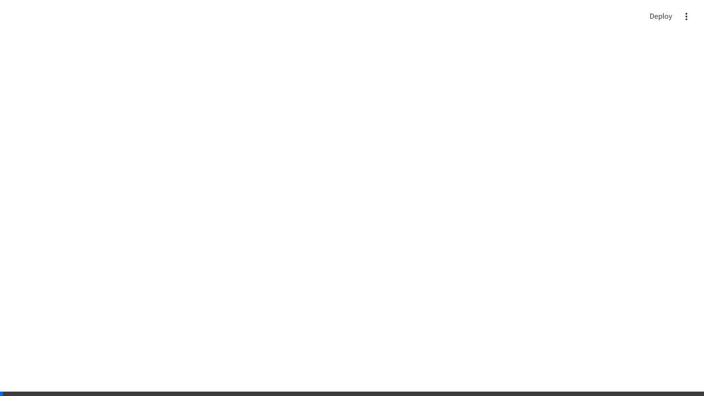

# 🛰️ Watershed Photo-Satellite Fusion — Demo Walkthrough

> **Smart India Hackathon 2026** — Field Evidence × Satellite Intelligence

---

## 🌟 Executive Summary

This project delivers an end-to-end multi-modal verification layer for watershed management interventions. Field workers upload geo-tagged photos of interventions (check dams, farm ponds, plantations), and this platform automatically cross-references ground-level visual evidence against temporal multi-spectral Sentinel-2 satellite imagery at that exact coordinate, flagging mismatches and calculating a 0–100 watershed health index.

---

## 📸 Visual Demo & Screenshots

### 1. Main Dashboard — 3D Interactive WebGL Globe & Monitoring HUD
The dashboard features an interactive 3D WebGL sensor globe centered on the watershed network, with real-time status counters, health gauges, and two-way synchronization.

*Key Highlights:*
- **3D Sensor Globe**: Powered by Three.js & Globe.gl with glowing atmosphere, radar ripples, and color-coded status pins.
- **Top Metrics Bar**: Instant breakdown of total sites, confirmed interventions, flagged anomalies, and overall watershed health index.
- **Dual Visual Modes**: Toggle seamlessly between the 3D Interactive Globe and 2D High-Resolution Sentinel-2 multi-spectral tile maps.

---

### 2. S06 Anomaly Detection — The "Demo Beat"
A field worker claims site **S06** is a constructed **Farm Pond**. Our platform cross-examines the claim using multi-spectral satellite imagery and OpenAI CLIP zero-shot photo classification, instantly flagging a high-priority mismatch.

#### The Evidence Breakdown for Site S06:
| Modality | Expected (Claimed: Farm Pond) | Detected Reality | Status |
| :--- | :--- | :--- | :--- |
| **Field Photo** | Farm pond water harvesting | Classified as **Degraded Land** (82% confidence) | 🚨 Mismatch |
| **NDWI (Water)** | Increase / Positive (water accumulation) | `0.205` → `-0.277` (▼ Declining moisture) | 🚨 Anomaly |
| **NDVI (Vegetation)** | Stabilizing vegetation around reservoir | `0.085` → `0.051` (▼ Deteriorating cover) | 🚨 Anomaly |
| **Health Score** | Nominal 70+ | **37 / 100 (Grade D)** | 🚨 High Risk |

#### 3 Automated Flags Raised:
1. `NDWI trend contradicts farm_pond claim`
2. `No water signature detected (NDWI = -0.277)`
3. `Photo classified as degraded_land, not farm_pond`

---

### 3. Full Interaction Flow Demo
Watch the complete live interaction: selecting sites via the 3D globe, drilling into multi-spectral deltas, inspecting satellite before/after imagery, and evaluating the health scoring algorithm:

---

## 📊 Summary of Verified Results

Across the Ahmednagar watershed test network:

| Metric | Result | Notes |
| :--- | :--- | :--- |
| **Total Monitored Sites** | `8` | Sites S01 through S08 |
| **✅ Verified & Confirmed** | `7` | Interventions validated by satellite and photo concordance |
| **🚨 Flagged Anomalies** | `1 (S06)` | False claim of farm pond detected and highlighted |
| **⚠️ Inconclusive** | `0` | All sites had sufficient multi-modal signals |
| **Average Watershed Health** | `72 / 100` | Baseline healthy watershed condition |

---

## 🛠️ Key Technical Components

1. **`globe_selector/`**: Custom Streamlit 3D WebGL Globe component communicating bidirectionally with Streamlit via postMessage.
2. **`src/gee_client.py`**: Google Earth Engine client querying Sentinel-2 Harmonized surface reflectance, computing temporal NDVI & NDWI with 10-second fail-fast timeout and local caching.
3. **`src/classifier.py`**: OpenAI CLIP (ViT-B/32) zero-shot image classifier customized for watershed interventions (check dam, farm pond, plantation, degraded land, water body).
4. **`src/cross_validator.py`**: Multi-modal rule engine comparing satellite delta trends against photo classification to emit anomaly flags.
5. **`src/health_score.py`**: Weighted multi-factor health index (NDVI trend, NDWI trend, multi-modal agreement, model confidence).
6. **`utils/db_utils.py`**: Embedded SQLite database for historical tracking and audit trails.
