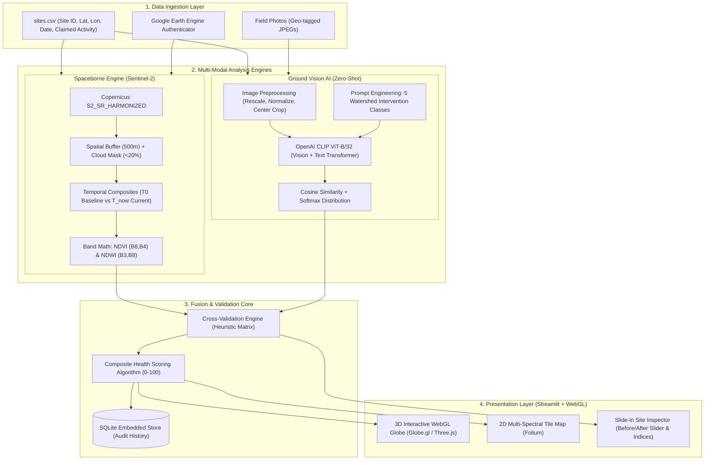
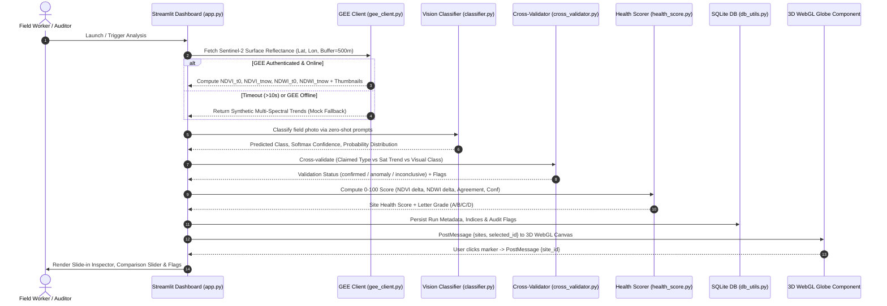
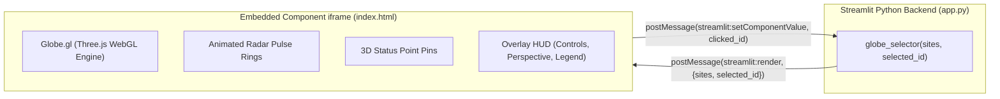

# 🛰️ Technical Architecture & Approach Specification
## Watershed Photo-Satellite Fusion System
### Smart India Hackathon 2026 • Clean Water Initiative

---

## 📑 Table of Contents
1. [Executive Summary & Problem Statement](#1-executive-summary--problem-statement)
2. [High-Level Architectural Overview](#2-high-level-architectural-overview)
3. [System Flow & Data Pipeline](#3-system-flow--data-pipeline)
4. [Deep-Dive: Modalities & Core Engines](#4-deep-dive-modalities--core-engines)
   - [4.1 Spaceborne Remote Sensing Layer (GEE + Sentinel-2)](#41-spaceborne-remote-sensing-layer-gee--sentinel-2)
   - [4.2 Ground-Level Visual Intelligence (OpenAI CLIP ViT-B/32)](#42-ground-level-visual-intelligence-openai-clip-vit-b32)
   - [4.3 Cross-Validation & Anomaly Detection Engine](#43-cross-validation--anomaly-detection-engine)
   - [4.4 Multi-Factor Watershed Health Scoring Algorithm](#44-multi-factor-watershed-health-scoring-algorithm)
   - [4.5 3D WebGL Globe & Frontend Component Architecture](#45-3d-webgl-globe--frontend-component-architecture)
   - [4.6 Caching, Offline Resiliency & Persistence Layer](#46-caching-offline-resiliency--persistence-layer)
5. [Tooling Matrix & Rationale](#5-tooling-matrix--rationale)
6. [Failure Modes & Edge Case Mitigation](#6-failure-modes--edge-case-mitigation)
7. [Future Roadmap & Scale Strategy](#7-future-roadmap--scale-strategy)

---

## 1. Executive Summary & Problem Statement

In watershed management programs (e.g., PMKSY, MGNREGA, NABARD watershed development funds), public funds are allocated for localized water harvesting and soil conservation structures:
- **Check Dams**: Barrier structures built across streams to impede flow, promote percolation, and stabilize banks.
- **Farm Ponds**: Excavated dugouts to capture monsoon surface runoff for supplementary irrigation.
- **Afforestation / Hill Plantations**: Tree planting along contour lines to combat erosion and improve canopy interception.

### The Operational Challenge
Field personnel upload geo-tagged photos to substantiate work completion. However:
1. **Administrative Blindspots**: Verification officers cannot physically inspect thousands of scattered micro-watershed interventions across arid districts.
2. **False or Ghost Claims**: Photos may show dry, barren gullies or misrepresent existing natural landscape features as newly constructed assets.
3. **Temporal Neglect**: A pond built in 2023 may silt up, dry out, or fail within 12 months, but static photo records provide zero temporal health tracking.
4. **Lack of Cross-Referencing**: Ground evidence is completely isolated from the petabytes of freely available Earth Observation data collected by satellites daily.

### The Solution
The **Watershed Photo-Satellite Fusion System** fuses **field-level photographic evidence** with **high-frequency Sentinel-2 multi-spectral remote sensing** to establish an automated, tamper-resistant cross-validation and monitoring pipeline.

```
Ground Truth Evidence (Photo + Lat/Lon) ──┐
                                          ├─► Multi-Modal Fusion Engine ──► Anomaly Alerts + Health Index (0-100)
Satellite Observations (Temporal Indices) ─┘
```

---

## 2. High-Level Architectural Overview

The platform operates across four decoupled layers: Ingestion, Multi-Modal Inference, Cross-Validation, and Presentation.



---

## 3. System Flow & Data Pipeline

The end-to-end processing pipeline executes in five sequential phases:



---

## 4. Deep-Dive: Modalities & Core Engines

### 4.1 Spaceborne Remote Sensing Layer (`src/gee_client.py`)
- **Sensor**: European Space Agency (ESA) Copernicus Sentinel-2 Multi-Spectral Instrument (MSI), Level-2A (Bottom of Atmosphere / Surface Reflectance: `COPERNICUS/S2_SR_HARMONIZED`).
- **Spatial Resolution**: 10 meters per pixel for visible (B2, B3, B4) and Near-Infrared (B8) bands.
- **Temporal Windows**:
  - **$T_0$ (Baseline)**: Pre-intervention / historical reference period (e.g., January–March 2024).
  - **$T_{now}$ (Post-Intervention)**: Current evaluation period (e.g., June–August 2026).
- **Cloud Filtering**: Median composite across the window with pixel QA cloud mask $\le 20\%$ to prevent atmospheric false positives.
- **Mathematical Formulations**:
  1. **Normalized Difference Vegetation Index (NDVI)**:
     $$\text{NDVI} = \frac{\text{B8 (NIR)} - \text{B4 (Red)}}{\text{B8 (NIR)} + \text{B4 (Red)}}$$
     - *Range*: $[-1.0, +1.0]$. Values $> 0.2$ indicate sparse vegetation; $> 0.4$ indicate dense, active biomass.
     - *Usage*: Evaluates whether plantations and catchment vegetative buffer zones are growing.
  2. **Normalized Difference Water Index (NDWI - McFeeters)**:
     $$\text{NDWI} = \frac{\text{B3 (Green)} - \text{B8 (NIR)}}{\text{B3 (Green)} + \text{B8 (NIR)}}$$
     - *Range*: $[-1.0, +1.0]$. Positive values ($> 0.0$) typically denote open water bodies; values between $-0.15$ and $0.0$ indicate saturated soils or shallow wetlands.
     - *Usage*: Confirms water retention in farm ponds, check dam impoundments, and percolation tanks.

---

### 4.2 Ground-Level Visual Intelligence (`src/classifier.py`)
Instead of training a fragile, small-dataset supervised model prone to overfitting on regional soil varieties, the system implements **OpenAI CLIP (Contrastive Language-Image Pretraining)** with a **ViT-B/32** transformer backbone via `open-clip-torch`.

- **Mechanism**:
  1. An image is passed through a 12-layer Vision Transformer (ViT-B/32) to generate a 512-dimensional visual embedding vector $\vec{v}$.
  2. Five domain-engineered textual prompts are encoded via CLIP's Text Transformer into normalized text embeddings $\vec{t}_i$:
     - `"a photograph of a check dam built across a stream or river for water conservation"`
     - `"a photograph of a farm pond or dugout pond used for irrigation and water harvesting"`
     - `"a photograph of a tree plantation or afforestation area with rows of planted trees"`
     - `"a photograph of degraded barren land with soil erosion and no vegetation"`
     - `"a photograph of a water body such as a lake reservoir or large pond"`
  3. The cosine similarity is computed across all prompt vectors:
     $$\text{sim}_i = \frac{\vec{v} \cdot \vec{t}_i}{\|\vec{v}\| \|\vec{t}_i\|}$$
  4. Class probabilities are derived via temperature-scaled Softmax:
     $$P(\text{class}_i) = \frac{\exp(100 \cdot \text{sim}_i)}{\sum_j \exp(100 \cdot \text{sim}_j)}$$

---

### 4.3 Cross-Validation & Anomaly Detection Engine (`src/cross_validator.py`)
The engine cross-checks the ground photo classification against the satellite index deltas ($\Delta \text{NDVI} = \text{NDVI}_{now} - \text{NDVI}_{0}$, $\Delta \text{NDWI} = \text{NDWI}_{now} - \text{NDWI}_{0}$).

#### Consistency Decision Matrix
| Claimed Intervention | Expected Satellite Dynamics | Validation Criteria | Flags Emitted on Violation |
| :--- | :--- | :--- | :--- |
| **Check Dam** | Vegetation stabilization + periodic water impoundment | $\Delta\text{NDVI} \ge -0.05$<br>$\Delta\text{NDWI} \ge 0.00$ | `NDWI trend contradicts check_dam claim`<br>`NDVI decline suggests structural failure` |
| **Farm Pond** | Clear water signature accumulation | $\Delta\text{NDWI} \ge 0.00$<br>$\text{NDWI}_{now} \ge -0.15$ | `NDWI trend contradicts farm_pond claim`<br>`No water signature detected` |
| **Plantation** | Substantial vegetative biomass expansion | $\Delta\text{NDVI} \ge +0.05$<br>$\Delta\text{NDWI} \ge -0.15$ | `NDVI trend contradicts plantation claim`<br>`Vegetation declined or failed to grow` |
| **Water Body** | Persistent high water index | $\text{NDWI}_{now} \ge -0.05$<br>$\Delta\text{NDVI} \ge -0.20$ | `Water index insufficient for water body` |
| **Degraded Land** | Arid, low vegetation baseline | $\Delta\text{NDVI} \le +0.10$<br>$\Delta\text{NDWI} \le 0.00$ | *Benchmark control class* |

#### Multi-Modal Photo Verification
If $\text{Predicted\_Class} \ne \text{Claimed\_Type}$ with confidence $> 60\%$:
- The site is flagged with: `Photo classification mismatch: classified as '[Predicted]' ([Conf]%), but claimed as '[Claimed]'`.

#### Case Study: Site S06 (The "Demo Beat")
- **Claim**: Farm Pond.
- **Field Photo Reality**: Barren dirt pit with no water, dry cracked soil.
- **CLIP Classification**: `degraded_land` (82% confidence).
- **Sentinel-2 Data**: $\text{NDWI}_{now} = -0.277$ (declined by $-0.071$), $\text{NDVI}$ dropped to $0.051$.
- **Engine Verdict**: **🚨 ANOMALY DETECTED** with 3 concurrent red flags; health score downgraded to **37/100 (Grade D)**.

---

### 4.4 Multi-Factor Watershed Health Scoring Algorithm (`src/health_score.py`)
Each site receives a holistic score $S \in [0, 100]$ balancing remote sensing biophysics, multi-modal agreement, and model certainty:

$$S = w_{\text{NDVI}} \cdot S_{\text{NDVI}} + w_{\text{NDWI}} \cdot S_{\text{NDWI}} + w_{\text{agree}} \cdot S_{\text{agree}} + w_{\text{conf}} \cdot S_{\text{conf}}$$

#### Weights & Normalization:
1. **$w_{\text{NDVI}} = 0.30$ (Vegetation Vitality)**:
   $$S_{\text{NDVI}} = \text{clamp}\left(\frac{\Delta \text{NDVI} - (-0.30)}{0.30 - (-0.30)} \cdot 100, 0, 100\right)$$
2. **$w_{\text{NDWI}} = 0.30$ (Hydrological Presence)**:
   $$S_{\text{NDWI}} = \text{clamp}\left(\frac{\Delta \text{NDWI} - (-0.30)}{0.30 - (-0.30)} \cdot 100, 0, 100\right)$$
3. **$w_{\text{agree}} = 0.25$ (Inter-Modal Concordance)**:
   - $S_{\text{agree}} = 100$ if status is `confirmed`
   - $S_{\text{agree}} = 50$ if status is `inconclusive`
   - $S_{\text{agree}} = \max(0, 30 - 15 \times \text{num\_flags})$ if status is `anomaly`
4. **$w_{\text{conf}} = 0.15$ (Classification Certainty)**:
   $$S_{\text{conf}} = \text{Confidence} \times 100$$

#### Grade Thresholds:
- **Grade A (80–100)**: Exemplary intervention; high water/vegetation growth and verified photo proof.
- **Grade B (65–79)**: Sound intervention; positive index trends with minor seasonal variation.
- **Grade C (50–64)**: Marginal performance; low water accumulation or slow vegetative establishment.
- **Grade D (<50)**: Critical anomaly; failed intervention, false claim, or severe degradation.

---

### 4.5 3D WebGL Globe & Frontend Component Architecture (`globe_selector/`)
To satisfy modern hackathon standards and deliver an engaging visual command center, the dashboard features a **custom two-way Streamlit component**:



- **Styling Architecture**: Built with `Space Grotesk` (headings/body) and `IBM Plex Mono` (telemetry, coordinates, and codes). The palette uses `#05070d` space black, `#0d2b3e` glassmorphic teal, `#3ddc97` confirmed mint, and `#ff5d5d` anomaly coral.
- **HUD Controls**: Interactive camera buttons enable single-click switches between:
  - 🎯 **Focus Watershed**: Smooth camera fly-to centering on the Ahmednagar Basin ($19.1^\circ\text{N}, 74.7^\circ\text{E}$ at altitude $0.65$).
  - 🌍 **Orbit Perspective**: High-altitude global overview.
  - 🔄 **Auto-Rotate**: Toggles smooth continuous azimuthal rotation.
- **2D / 3D Dual Mode**: Users can switch instantly between the 3D globe and a high-resolution 2D Folium satellite map with Leaflet tiles.

---

### 4.6 Caching, Offline Resiliency & Persistence Layer
- **Fail-Fast GEE Fallback**: Remote sensing APIs can stall under strict network firewalls. The `initialize_gee()` call incorporates a multi-threaded **10-second timeout**. If unreachable, the system falls back to realistic synthetic Sentinel-2 indices and generates cached thumbnails locally, allowing live demonstrations even with zero internet.
- **Disk Caching (`cache/`)**: Per-site cached JSON analysis and RGB before/after PNGs prevent redundant API queries.
- **SQLite Persistence (`db/watershed.db`)**: Saves structured site runs, classification distributions, and validation flags to provide auditability across sessions.

---

## 5. Tooling Matrix & Rationale

| Tool / Library | Role | Why Selected Over Alternatives |
| :--- | :--- | :--- |
| **Python 3.11+** | Core Programming Language | Universal ecosystem for geospatial analysis, ML inference, and dashboarding. |
| **Streamlit** | Interactive Web Application | Enables rapid development of reactive dashboards with native Python state management. |
| **Three.js & Globe.gl** | 3D WebGL Sensor Visualization | Renders performant hardware-accelerated 3D planetary geometry and custom shaders inside an iframe. |
| **Google Earth Engine (earthengine-api)** | Spaceborne Remote Sensing | Provides instant server-side band math and spatial aggregation without downloading gigabytes of raw Sentinel-2 granules. |
| **OpenAI CLIP (`open-clip-torch`)** | Zero-Shot Field Photo Vision | Eliminates the need for hand-labeling thousands of training images; robust to lighting, camera angles, and ground clutter. |
| **Folium & Leaflet** | 2D Cartography Fallback | Supports tile layer switching (Satellite, OpenStreetMap, CartoDB Dark) and coordinate pin inspection. |
| **Streamlit Image Comparison** | Before/After Image Slider | Intuitive slider widget allowing visual comparison between $T_0$ and $T_{now}$ satellite snapshots. |
| **SQLite3** | Embedded Persistence | Zero-config, file-based relational store enabling audit trails without external server overhead. |

---

## 6. Failure Modes & Edge Case Mitigation

| Potential Edge Case | Impact | Mitigation Strategy |
| :--- | :--- | :--- |
| **Heavy Cloud Cover during Monsoon** | Optical Sentinel-2 bands obscured by cloud and cloud shadows. | Cloud QA band filtering (`QA60`); if cloud coverage $> 20\%$, the temporal window expands automatically by 30 days. Future roadmap integrates Sentinel-1 SAR (C-band radar). |
| **Low-Resolution Field Photo / Blur** | Reduced visual clarity for feature extraction. | CLIP ViT backbone rescales and extracts global compositional tokens. Low confidence ($< 45\%$) triggers an `inconclusive` status rather than false positive anomaly alerts. |
| **Seasonal Ephemeral Farm Ponds** | Ponds naturally dry out in peak summer (May), risking false anomaly flags. | Baseline window ($T_0$) and evaluation window ($T_{now}$) are matched to identical calendar seasons (e.g., post-monsoon vs post-monsoon). |
| **Network Outage During Live Demo** | Remote API calls hang indefinitely. | Threaded 10-second fail-fast timeout in `gee_client.py` activates realistic synthetic fallbacks, ensuring uninterrupted operation. |

---

## 7. Future Roadmap & Scale Strategy

1. **Synthetic Aperture Radar (SAR) Fusion (Sentinel-1)**:
   - Incorporate Sentinel-1 dual-polarization (VV + VH) backscatter to penetrate monsoon cloud cover and directly measure soil moisture and standing water year-round.
2. **Automated GeoTIFF Upload Pipeline**:
   - Enable drone ortho-mosaics and high-resolution commercial satellite imagery (PlanetScope 3m resolution) for micro-dams under 5 meters wide.
3. **Smart Contract / Blockchain Escrow Trigger**:
   - Link confirmed intervention health scores to automated milestone disbursement under Direct Benefit Transfer (DBT) schemes.
4. **Mobile Edge Capture (ODK / PWA)**:
   - Embed lightweight MobileCLIP directly on field workers' smartphones for offline photo verification and EXIF anti-spoofing validation before sync.
